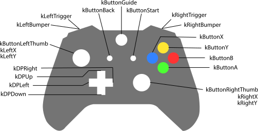

###### [<- Back](../documentation.md)
## Input System
<center>

| [Keyboard](#keyboard) - [Mouse](#mouse) - [Controller](#controller) |
:----------------------------------------------------------: |

</center>

#### **Keyboard:**
For the use of the keyboard you have the option to use input customs:

To add a custom one just use the function `addActionMapping()`

Where you enter the name with which you want to save and the number of the key with code **ASCII**

```c++
input.addActionMapping("EXAMPLE",80); //80 = P
```

To edit you only need to use the name you registered before and change the id in **ASCII**.

```c++
static int i0 = 80;
ImGui::InputInt("Code ASCII to change", &i0);
if (ImGui::Button("Change Example")) {
	input.modifyActionMapping("EXAMPLE",i0); //To change the key
}
```

To delete you only have to enter the name.

```c++
ImGui::Text("Remove Example");
if(ImGui::Button("Remove Example")) {
	input.removeActionMapping("EXAMPLE"); //To delete the action
}
```

Then, when recognizing the keyboard inputs, we will have to press the key.

```c++
//Check input pressed with letter
if (input.isKeyPressed("A")) {
	printf("Key pressed A\n");
}

//Check input pressed with custom
if (input.isKeyPressed("JUMP")) {
	printf("JUMPING\n");
}

//Check input with example add
if (input.isKeyPressed("EXAMPLE")) {
	printf("Example is pressed \n");
}
```

Then we have the option to create a key axis with two options `Input::Axis::kVertical` and `Input::Axis::kHorizontal`.

```c++
float keyboard_y_axis = input.getAxis(Input::Axis::kVertical);
if (keyboard_y_axis !=0) {
	printf("%f\n", keyboard_y_axis);
}
```


#### **Mouse:**
For the use of the mouse we have available the position both in the x-axis and y-axis based on the window by setting the 0,0 in the upper corner of the window.
```c++
float position_x = input.getMousePositionX();
float position_y = input.getMousePositionY();
printf("[X]:%f | [Y]:%f\n", position_x, position_y);
```

If you need set the position of the mouse use the funtion `setMousePosition(float x, float y)`.

If you need to change the visibility of the mouse use the funtion `setMouseVisibility(bool)`.

To check whether a mouse button has been pressed, use the function `isMouseButtonPressed()`

Where inside it you have to pass an name of the button if you wont.
```c++
MOUSE LEFT /**< Left mouse button. */
MOUSE RIGHT /**< Right mouse button. */
MOUSE MIDDLE /**< Middle mouse button. */
MOUSE 4 
MOUSE 5 
MOUSE 6  
MOUSE 7  
MOUSE 8
```
```c++
if (input.isMouseButtonPressed("MOUSE RIGHT")) {
	printf("Mouse Right Press\n");
}
```

#### **Controller:**
> [!IMPORTANT]  
> The use of only one control is allowed

If you want use the controllers input you need use `detectConnectedJoysticks()`. This funcion search all the compatible devices with the program and save in a list with the name of the device.

```c++
input.detectConnectedJoysticks(); //This for detect

std::map<std::string, int> connectedJoysticks = input.getConnectedJoysticks(); //This save the list of the devices

//This print the list with the name and index.	
for (const auto& pair : connectedJoysticks) {
	std::cout << "Joystick: " << pair.first << ", Index: " << pair.second << std::endl;
}
```

You have two options within control to take the asix or the button check. To these functions you have to pass the counters that you see in the following image.

<p align="center">
  
</p>

Button check:
```c++
if (input.isJoystickButtonPressed(input.kButtonX)) {
	printf("Button X\n");
}
```

Take the asix:
```c++
float xAxis = input.getJoystickAxis(input.kLeftX);
std::cout << "Eje X del Mando: " << xAxis << std::endl;
```

There is the option to change the dead zone for the axis:
```c++
//For set:
input.setDeadZone(0.09f);
//For get:
float aux = input.getDeadZone();
printf("Dead zone: %f\n");
```